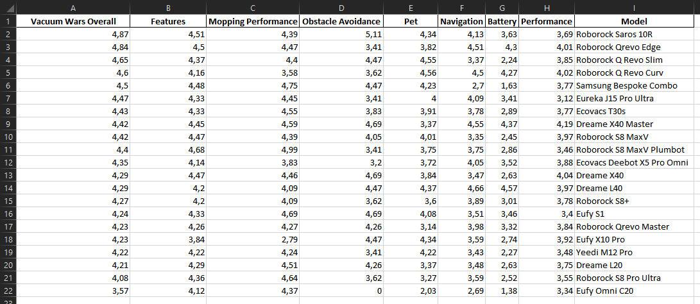
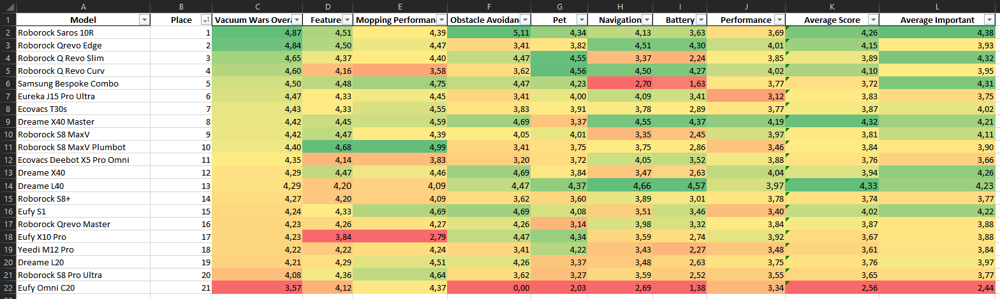

### Vacuum Wars Top 20 extract

The script scrapes the data from [Vacuum Wars Top 20 robots](https://vacuumwars.com/best-vacuum-cleaners/robot-vacuums/) and puts it to Excel file for easier comparison.

Raw export (script output):  

Prettified export (done manually):  

### Installation

1. Clone this project  
2. Install required packages  
`pip install -r .\requirements.txt`

### Usage
`python extract_vw.py`

Output Excel file is saved to local directory

